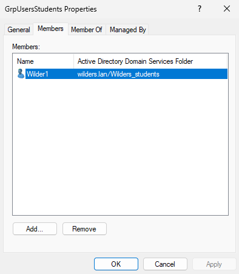
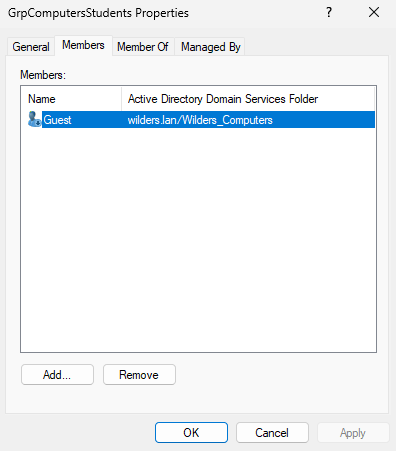
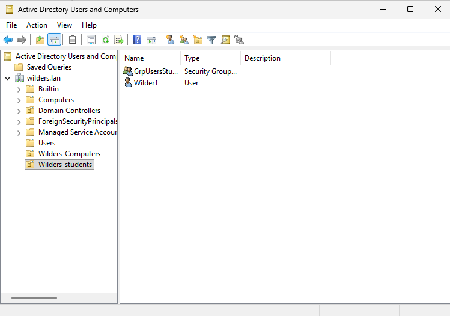
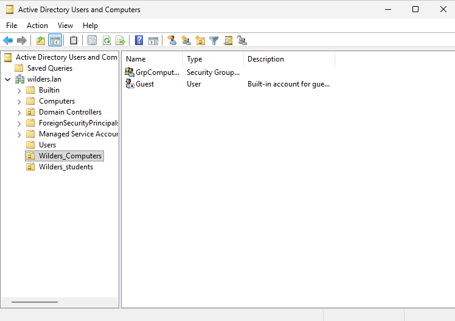
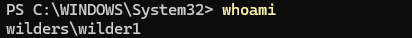

# Réponse

#### **OU utilisateurs où on voit le compte utilisateur :**

#### **OU ordinateur où on voit le client :**

#### **La fenêtre du groupe utilisateur dans laquelle on voit l'utilisateur membre :**

#### **La fenêtre du groupe ordinateur dans laquelle on voit le client membre :**

#### **Résultat de la commande whoami :**

